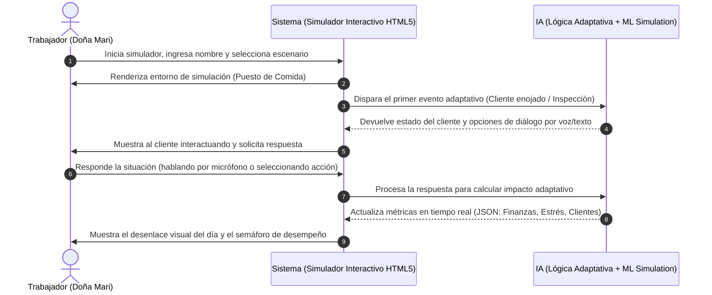

# PACKET: Simulador Oficio 3D y Entrenamiento Adaptativo (Semana 6)

## 1. El Problema en Mis Propias Palabras
Los microcomerciantes del sector informal cometen errores costosos en tiempo, dinero y seguridad física al aprender a manejar sus puestos directamente en la calle por "ensayo y error". No existe una forma segura, interactiva y digital de "fabricar experiencia" comercial y de servicio al cliente antes de enfrentarse al entorno real.

## 2. Definición de Éxito Exacto del Usuario
**Entrada:** El usuario ingresa su nombre, tipo de negocio (comida informal) y selecciona un escenario de entrenamiento.
**Procesamiento:** El sistema genera un entorno interactivo visual de un puesto, simula la llegada de clientes dinámicos procesados con lógica adaptativa (ML/Simulación de estados) y analiza las acciones del usuario (voz o selección táctil).
**Salida:** El sistema renderiza el impacto de las decisiones en un tablero visual (Afluencia, Ganancia, Nivel de Estrés) y devuelve un reporte estructurado en JSON con el aprendizaje obtenido.
**Éxito:** Antes de que el módulo de entrenamiento se cierre, el usuario logra completar una simulación de venta interactiva completa, recibe retroalimentación y visualiza su constancia de experiencia fabricada.

## 3. Flujo del Proceso (Diagrama de Mermaid)

## 4. Línea de Referencia (Benchmark)
**La mejor solución existente en la Tierra para esto es:** Los simuladores corporativos avanzados de servicio al cliente basados en VR o plataformas de capacitación de retail en Realidad Virtual.
**La mía difiere o se localiza por:** Estar diseñada sin barreras tecnológicas, corriendo directamente en un navegador móvil clásico (HTML5/Canvas), adaptada al vocabulario del comercio popular mexicano y simulando específicamente los retos de la calle sin requerir visores caros.

## 5. Light Charter (Párrafo a Largo Plazo)
En tres años, esta plataforma evolucionará hasta convertirse en una academia virtual inmersiva de acceso masivo (Metaverso del Trabajo Informal) operada por comandos de voz nativos. Permitirá a millones de personas en América Latina certificar sus habilidades operativas, de servicio y financieras mediante simulaciones interactivas antes de solicitar microcréditos productivos. Esto transformará la educación laboral de los sectores más vulnerables de la economía.

## 6. Corte de Telescopio (Lo que NO estamos construyendo)
- NO estamos construyendo un videojuego 3D en Unreal Engine ni Unity de alta fidelidad.
- NO estamos integrando hardware externo obligatorio (visores VR Oculus/Meta Quest).
- NO estamos construyendo una base de datos multijugador en tiempo real ni chats persistentes entre usuarios.

## 7. Arquitectura y Tabla de Stack (Dragon Stack)

| Capa | Tecnología | Rol en el Proyecto |
| :--- | :--- | :--- |
| **Frontend Inmersivo** | HTML5 Canvas / CSS3 3D Perspective / TailwindCSS | Renderizado del entorno de simulación visual y controles adaptados. |
| **Lógica Adaptativa / ML** | JavaScript (State Machine Pattern / Algoritmo Predictivo Local) | Simulación inteligente del comportamiento del cliente y cálculo de impacto financiero. |
| **Componente Extra (Voz)** | Web Speech API (Speech Recognition + Synthesis) | Permite a Doña Mari interactuar con el cliente "hablando" directamente a la app. |
| **Despliegue Estático** | Vercel | Alojamiento ágil en la nube de producción bajo costo cero. |

## 8. Plan de Pruebas (Test Plan)
- **Caso de Prueba 1 (Resolución Exitosa):** El usuario responde amablemente al cliente simulado -> La IA adaptativa incrementa las ganancias y reduce el estrés -> Al final se muestra "Éxito en la Jornada" y el JSON limpio.
- **Caso de Prueba 2 (Fricción Extrema):** El usuario responde agresivamente o ignora el límite de tiempo -> El simulador detona un "Cierre Forzado" por nivel de estrés crítico -> Se muestra el semáforo en rojo.
